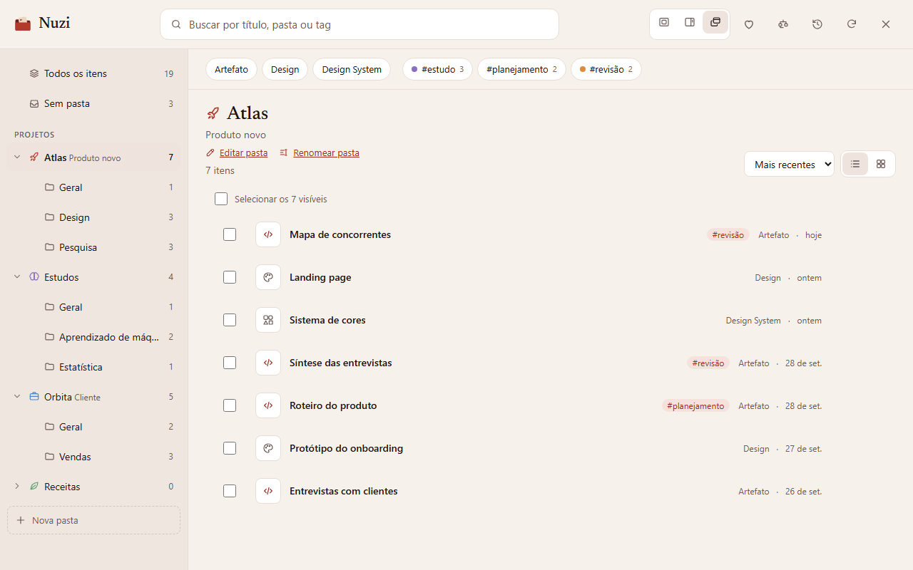

<p align="center">
  
</p>

<h1 align="center">Nuzi</h1>

<p align="center">
  <strong>O arquivo pessoal dos seus artefatos do claude.ai.</strong><br />
  Extensão gratuita para o Chrome · <a href="https://chromewebstore.google.com/detail/hfbdeilgpgijfpieddeolkdeidgphkol">instale na Chrome Web Store</a>
</p>

<p align="center">
  <a href="https://chromewebstore.google.com/detail/hfbdeilgpgijfpieddeolkdeidgphkol"><strong>Instalar</strong></a> ·
  <a href="https://henrique2m.github.io/nuzi-site/">Site</a> ·
  <a href="https://henrique2m.github.io/nuzi-site/#tabua">Como funciona</a> ·
  <a href="https://henrique2m.github.io/nuzi-site/privacidade/">Privacidade</a> ·
  <a href="https://henrique2m.github.io/nuzi-site/apoiar/">Cesto de tokens</a> ·
  <a href="https://github.com/henrique2m/nuzi-site/issues">Suporte e ideias</a>
</p>

<p align="center">
  
</p>

Dezenas de artefatos e projetos do Claude Design numa lista só? A Nuzi dá a cada um um lugar e uma etiqueta: projetos, subpastas e tags.

Este repositório guarda **o site público da Nuzi**. O código da extensão fica num repositório privado.

## A organização mora no nome

A Nuzi não tem banco de dados: ela escreve a pasta no próprio nome do artefato. Por isso a organização sincroniza entre dispositivos e continua valendo mesmo sem a extensão.

```
Projeto / Subpasta / Título #tag

Atlas / Pesquisa / Mapa de concorrentes #revisão
Orbita / Painel de vendas
Anotações da reunião                      → sem pasta
```

## O que ela faz

| Encontrar                                            | Organizar                          | Com segurança                                   | Do seu jeito                             |
| ---------------------------------------------------- | ---------------------------------- | ----------------------------------------------- | ---------------------------------------- |
| Artefatos e projetos do Claude Design juntos         | Mover vários itens de uma vez      | Pré-visualização "nome atual → nome novo"       | Modal, painel lateral ou janela própria  |
| Árvore de pastas com contagens                       | Arrastar direto para a pasta       | Um item por vez, conferido depois               | Tema claro e escuro                      |
| Busca sem acentos, filtros por tipo e tag            | Renomear uma pasta inteira         | Histórico com desfazer                          | Teclado completo e leitores de tela      |
| Lista ou grade com prévias                           | Descrição, ícone e cor por pasta   |                                                 |                                          |

## Nada sai do seu navegador

- **Sem servidor:** sem conta, sem telemetria, sem anúncios.
- **Sem credenciais:** a Nuzi nunca lê nem guarda senhas, cookies ou tokens de sessão.
- **Só o nome:** ela altera apenas o nome dos seus artefatos, e só quando você confirma.

Os detalhes estão na [política de privacidade](https://henrique2m.github.io/nuzi-site/privacidade/).

## Por que "Nuzi"

Nuzi foi uma cidade da Mesopotâmia, a uns 12 km da atual Kirkuk, no Iraque, que viveu seu auge nos séculos XV e XIV a.C. As famílias guardavam em casa as próprias tábuas de argila: adoções, casamentos, terras, processos e testamentos, acumulados por várias gerações. Escavações entre 1925 e 1931 encontraram cerca de 5 mil tábuas; só o arquivo da família de Tehip-tilla reúne um quarto delas.

A Nuzi faz o mesmo com os seus artefatos: cada um no seu cesto, com etiqueta. O símbolo são três tábuas de argila entrando numa pasta de tijolo.

## Cesto de tokens

A Nuzi é gratuita e continua assim. Se ela te poupou tempo, [encha o cesto de tokens](https://henrique2m.github.io/nuzi-site/apoiar/): o apoio vira tokens de IA que usamos para criar coisas incríveis, primeiro a própria Nuzi, depois os próximos projetos. Nenhuma função depende disso.

## Suporte e ideias

Abra uma [issue](https://github.com/henrique2m/nuzi-site/issues/new/choose): há modelos para relatar um problema e para sugerir uma ideia. Não coloque dados pessoais nem links de artefatos privados.

## Sobre o site

HTML, CSS e JavaScript puros, sem build nem dependências, publicados pelo GitHub Pages a partir da branch `main`.

| Página                  | Caminho        |
| ----------------------- | -------------- |
| Início                  | `index.html`   |
| Política de privacidade | `privacidade/` |
| Termos de uso           | `termos/`      |
| Cesto de tokens         | `apoiar/`      |
| Página não encontrada   | `404.html`     |

| Arquivo                  | O que tem                                                                                    |
| ------------------------ | -------------------------------------------------------------------------------------------- |
| `assets/site.css`        | Paleta "Tijolo cozido" nos temas claro e escuro (grafite), layout e animações               |
| `assets/site.js`         | Cena da capa, friso de selo cilíndrico, demonstração, abas, cesto, topo e navegação         |
| `assets/img/motivos.svg` | Motivos mesopotâmicos: cunhas, roseta, estrela, zigurate, tamareira, tábua, água             |
| `assets/screens/`        | Capturas da extensão, feitas com dados fictícios                                             |

Tudo funciona sem JavaScript, só fica parado. Quem pede menos movimento ao sistema vê tudo já no lugar, sem animações.

Para ver localmente, sirva a pasta **acima** deste repositório, porque a página 404 usa caminhos absolutos em `/nuzi-site/`:

```bash
npx http-server .. -p 8765 -c-1
```

Depois abra `http://localhost:8765/nuzi-site/`.

## Direitos

O nome, o símbolo, as imagens e os textos da Nuzi pertencem a Henrique Moreira; veja [LICENSE](LICENSE). O código fica visível para transparência, não para reuso.

A Nuzi é um projeto independente, sem vínculo com a Anthropic. Claude e claude.ai são marcas da Anthropic.
